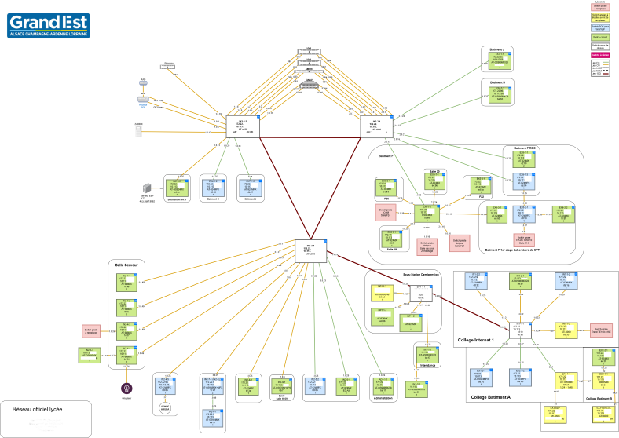
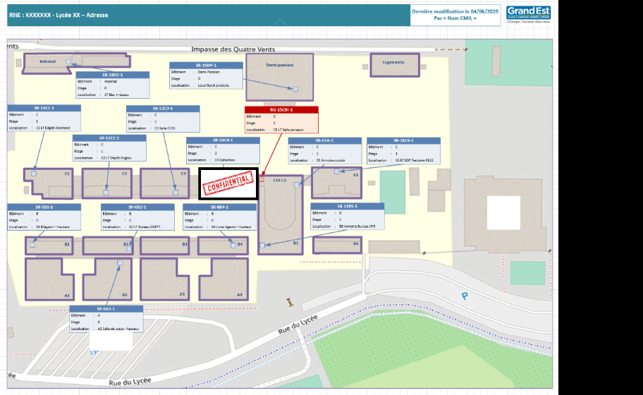

# Migration des schémas réseaux Draw.io vers Visio

Ce dépôt documente un projet réalisé durant mon stage de 2e année au sein de la Maison de région de Nancy pour les lycées de la région Grand Est. Il vise à migrer les anciens schémas réseaux conçus avec Draw.io vers Microsoft Visio, dans un souci d'harmonisation, de compatibilité professionnelle et de mise à jour des standards apporté par la documentation 'CARLA' pour la conformitée E4.

---

## 📌 Objectifs

- Analyse de l'existant
- Centraliser les anciens schémas Draw.io
- Reproduire fidèlement les schémas sous Microsoft Visio
- Améliorer la lisibilité, la standardisation et l'organisation
- Créer une documentation pour faciliter la maintenance future

---

## 🧰 Outils utilisés

- [Draw.io](https://app.diagrams.net/)
- Microsoft Visio 2024 (Stencils référent pour les équipements)
- Microsoft Excel 2024 (BDD)
- Script d’automatisation (export svg et pdf)

---

## 🖼️ Exemple avant/après

### Avant :

### Après :

---

## 📁 Organisation

- `drawio/` : Contient un exemple anonymisé d'ancien fichier `.drawio`
- `visio/` : Contient la version anonymisé migrée `.vsdx`
- `excel/` : Exemple de BDD pour un schéma Visio `.xlsx`
- `doc/` : Comptes rendus et documentation utile

---

## 🏛️ Contexte

Ce travail a été réalisé dans le cadre de mon stage pour le service informatique  **Vie des lycées de la région Grand Est**. L’objectif est de mettre en place une base de schémas professionnels pour faciliter l’administration réseau.

---

## ✅ Avancement

- [x] Recensement des fichiers Draw.io
- [x] Prise en main de Visio
- [ ] Migration des 6 schémas restant
- [ ] Rédaction d’un guide de migration
- [ ] Validation par l’équipe réseau

---

## 📄 Licence

Projet interne non librement réutilisable sans autorisation.

> ⚠️ Les schémas présents dans ce dépôt sont **entièrement anonymisés**.
> Aucune donnée réelle (IP, noms, identifiants, noms d’établissements) n’est utilisée.

